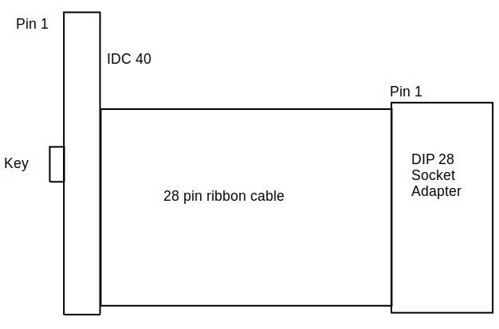

# emuprom
DIY ATmega8 based 27C256 EPROM emulator. Human accessible UART interface
(19200N1, CH340 on USB C).

Revision D has been verified and it is working as intended (working both with
TL866 EPROM programer and FellaPC computer).

# Target connection
Via ribbon cable with DIP-28 adapter. Uses 40 pin IDC connector, but only 28
pins are used. Target power state detection is supported (external bus is
resistant to the target high-z bus state).

Crude cable schematic, top view (should be enough to be able to make this cable):

Sanity check - EPROM GND (pin \#14) should be on the one before last wire (bottom of the picture).

# UART interface
Available via USB C UART port, 19200 baud, no parity, 1 stop bit. Interface is
human friendly, but also easy to script. Available commands:

- ? - help
- ! - claim bus, memory edit, assert /RST
- . - release bus, deassert /RST
- @ - set address mode
- \# - set data mode
- = - dump 256 bytes @addres
- t - memory test
- \+ - echo on
- \- echo off
- m - calculate md5 sum
- s - clear memory (all 0xff)
- r - reset target (pulse /RST)

Example sequence with comments:
- \- echo disable,
- ! - claims the bus,
- @0000 - sets address to zero,
- \# - selects data mode,
- 0102030405060708 - 8 bytes are written at address 0,
- . - release the bus and start the target,
- \+ - enable echo.

Or all at once: -!@0000#0102030405060708.+

# Uploading FW
avr-gcc, avr-libc and avrdude are needed.

- make (build FW),
- make fuse (set fuses to set internal RC @8MHz),
- make install (upload FW).

# Pictures
This is a picture of revision D. Note the recommended heat shrink sleeve, to
prevent accidental short circuits.

